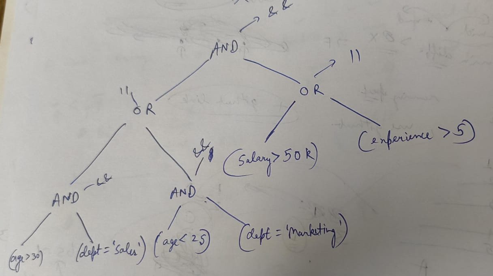

# 🛠️ Rule Engine with AST 🌳

Welcome to the **Rule Engine with AST** project! This application allows you to create, combine, and evaluate rules based on Abstract Syntax Trees (ASTs). It’s built using **React+Vite**, **ShadCN**, and **TailwindCSS** for the frontend, and **Node.js** with **Express** for the backend. 🚀

## 🎉 Features
1. **API Design**:
   - `create_rule(rule_string)`: Takes a string representing a rule and returns a Node object representing the corresponding AST.
   - `combine_rules(rules)`: Combines a list of rule strings into a single AST with efficiency considerations. Returns the root node of the combined AST.
   - `evaluate_rule(JSON data)`: Evaluates a JSON rule's AST against provided data and returns `True` if the rule matches the data, otherwise `False`.

2. Rules are evaluated through a tree structure where non-leaf nodes contain operators (AND/OR), and leaf nodes contain conditions. 🟢
3. Error handling for invalid rule strings or data formats is in place. 💡

## 🚀 How to Use
Follow these steps to run the project locally:

1. **Clone the GitHub Repo**:
```bash
git clone https://github.com/abhayraihal/rule_engine_with_ast.git
cd rule_engine_with_ast
```

2. **Open two terminals inside project folder**:

#### In the first terminal (Client):
```bash
cd client
npm install
npm run dev
```

#### In the second terminal (Server):
```bash
cd server
npm install
npm run dev
```

3. **Keep both terminals open**, and head to [http://localhost:5173/](http://localhost:5173/) to see the website. 🌐

   > **Note:** Make sure both frontend and backend servers are running simultaneously!

4. **Video Demo**: 
   - [Watch how to use the app and deploy it locally!](https://youtu.be/wJ9d5E1OLzY)

## 💻 Approach

The core idea is a tree-like structure where:
- Non-leaf nodes represent operators like **AND/OR**.
- Leaf nodes contain conditions.

When evaluating a rule, the computation starts from the leaf nodes, moves up to the non-leaf nodes, and continues until the root node returns the final result. 🏁

You can check out a rough sketch of the AST structure in the attached image within the GitHub repo: 


## 🌟 Potential Enhancements
- Display the AST in a more visually appealing way 🌈
- Use toast components for error handling and better user feedback 🍞
- Improve the UI for showing query results and errors 🚀

## 🛠️ Technologies Used
- **Frontend**: React, Vite, ShadCN, TailwindCSS
- **Backend**: Node.js, Express

## 🧠 Acknowledgments
This code is crafted with the brilliance of **Abhay**, combining the power of **GPT** and his sharp mind! 🤖💡
